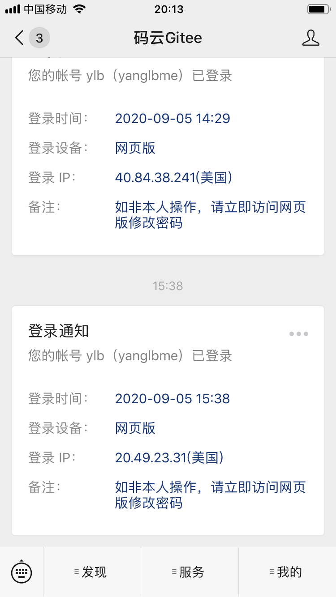
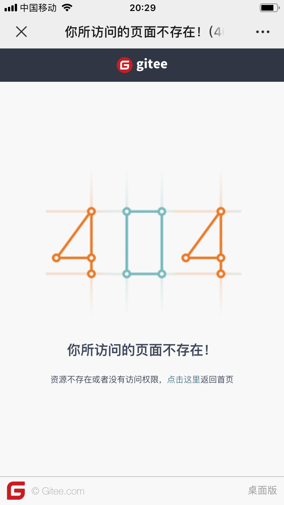

# 问题汇总

## 问题 1：遇到短信验证码导致无法自动部署，怎么解决？

因为 Gitee Pages Action 使用的是 GitHub 自家的服务器（美国），在这种情况下，当 Action 自动帮我们登录 Gitee 的时候，会触发 Gitee **帐号异常登录告警**，提示用户在非正常的 IP 地址登录了 Gitee，需要输入验证码。

**解决方案**是：关注「**Gitee**」微信公众号，绑定个人微信到码云帐号。这样 Action 在登录的过程中，Gitee 就不会下发短信验证码，而是通过「**Gitee**」公众号给我们发送一个登录通知，Action 就能成功登录了。

> 参考 [#6](https://github.com/yanglbme/gitee-pages-action/issues/6)。

## 问题 2：报 deploy error occurred, message: 'NoneType' object has no attribute 'group' 错误，怎么办？

报了这个错误，说明 Action 已经成功帮我们登录 Gitee 帐号了，但在访问 Gitee Repo 的过程中出现问题。

这种情况，一般是 Gitee Pages Action 的参数配置错误导致，请仔细检查你的配置信息。

注意：`gitee-repo` 参数严格区分大小写，请准确填写，比如 `doocs/advanced-java`，当你写成 `doocs/Advanced-java` 的时候，是访问不到的，不信你可以试试访问：https://gitee.com/Doocs/Advanced-java

> 参考 [#10](https://github.com/yanglbme/gitee-pages-action/issues/10)、[#12](https://github.com/yanglbme/gitee-pages-action/issues/12)。

