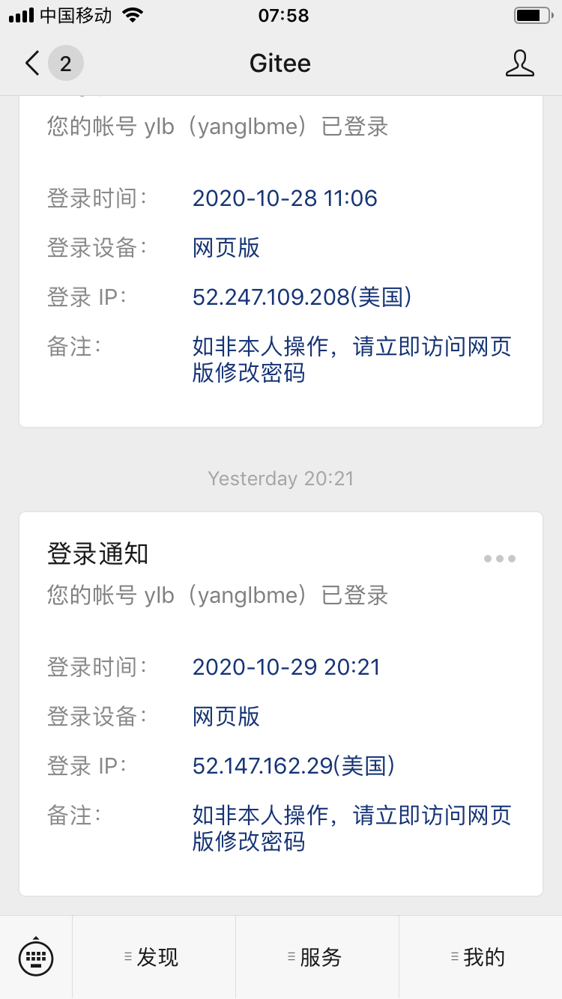

<p align="center">
  <a href="https://github.com/yanglbme/gitee-pages-action">
    
  </a>
</p>

<div align="center">

[](https://github.com/yanglbme/gitee-pages-action/actions) [](https://github.com/yanglbme/gitee-pages-action/actions) [](../../pulls) [](#谁在使用) [](https://app.fossa.com/projects/git%2Bgithub.com%2Fyanglbme%2Fgitee-pages-action?ref=badge_shield)<br>[](../../releases) [](https://github.com/yanglbme/gitee-pages-action) [](https://gitee.com/yanglbme/gitee-pages-action) [](#错误及解决方案)

</div>

<h1 align="center">Gitee Pages Action</h1>

由于 Gitee Pages 的访问速度很快，很多朋友会选择 Gitee Pages 部署项目（如：个人博客、开源项目国内镜像站点）。但是它不像 GitHub Pages 那样，一提交代码就能自动更新 Pages，因为 Gitee 的自动部署属于 Gitee Pages Pro 的服务。

为了实现 Gitee Pages 的自动部署，我开发了 [Gitee Pages Action](https://github.com/marketplace/actions/gitee-pages-action) ，只需要在 GitHub 项目的 Settings 页面下配置 keys，然后在 `.github/workflows/` 下创建一个工作流，引入一些配置参数即可。欢迎体验，若有使用上的问题，也欢迎随时在 [Issues](https://github.com/yanglbme/gitee-pages-action/issues) 反馈。

注：首次需要**手动**登录 Gitee ，点击“启动”进行 Gitee Pages 服务的部署。

## 入参

| 参数             | 描述                         | 是否必传 | 默认值   | 示例                            |
| ---------------- | ---------------------------- | -------- | -------- | ------------------------------- |
| `gitee-username` | Gitee 用户名                 | 是       | -        | `yanglbme`                      |
| `gitee-password` | Gitee 密码                   | 是       | -        | `${{ secrets.GITEE_PASSWORD }}` |
| `gitee-repo`     | Gitee 仓库（严格区分大小写） | 是       | -        | `doocs/advanced-java`           |
| `branch`         | 要部署的分支（分支必须存在） | 否       | `master` | `main`                          |
| `directory`      | 要部署的分支上的目录         | 否       |          | `src`                           |
| `https`          | 是否强制使用 HTTPS           | 否       | `true`   | `false`                         |

## 示例

以下是一个完整示例。

在你的 GitHub 仓库 `.github/workflows/` 文件夹下创建一个 `.yml` 文件，如 `sync.yml`，内容如下：

```yml
name: Sync

on: page_build

jobs:
  build:
    runs-on: ubuntu-latest
    steps:
      - name: Sync to Gitee
        uses: wearerequired/git-mirror-action@master
        env:
          # 注意在 Settings->Secrets 配置 GITEE_RSA_PRIVATE_KEY
          SSH_PRIVATE_KEY: ${{ secrets.GITEE_RSA_PRIVATE_KEY }}
        with:
          # 注意替换为你的 GitHub 源仓库地址
          source-repo: git@github.com:doocs/advanced-java.git
          # 注意替换为你的 Gitee 目标仓库地址
          destination-repo: git@gitee.com:Doocs/advanced-java.git

      - name: Build Gitee Pages
        uses: yanglbme/gitee-pages-action@main
        with:
          # 注意替换为你的 Gitee 用户名
          gitee-username: yanglbme
          # 注意在 Settings->Secrets 配置 GITEE_PASSWORD
          gitee-password: ${{ secrets.GITEE_PASSWORD }}
          # 注意替换为你的 Gitee 仓库，仓库名严格区分大小写，请准确填写，否则会出错
          gitee-repo: doocs/advanced-java
          # 要部署的分支，默认是 master，若是其他分支，则需要指定（指定的分支必须存在）
          branch: main
```

先使用 [wearerequired/git-mirror-action](https://github.com/wearerequired/git-mirror-action) 将 GitHub 仓库同步到 Gitee 仓库，再使用 [yanglbme/gitee-pages-action](https://github.com/yanglbme/gitee-pages-action) 实现 Gitee Pages 的自动部署。

**密钥的配置步骤如下（可展开看示例图）**：

<details>
<summary>1. 在命令行终端或 Git Bash 使用命令 <code>ssh-keygen -t rsa -C "youremail@example.com"</code> 生成 SSH Key，注意替换为自己的邮箱。生成的 <code>id_rsa</code> 是私钥，<code>id_rsa.pub</code> 是公钥。(⚠️注意此处不要设置密码)</summary>

</details>
<details>
<summary>2. 在 GitHub 项目的「​Settings -> Secrets」路径下配置好命名为 <code>GITEE_RSA_PRIVATE_KEY</code> 和 <code>GITEE_PASSWORD</code> 的两个密钥。其中：<code>GITEE_RSA_PRIVATE_KEY</code> 存放 <code>id_rsa</code> 私钥；<code>GITEE_PASSWORD</code> 存放 Gitee 帐号的密码。</summary>

</details>
<details>
<summary>3. 在 GitHub 的个人设置页面「<a href="https://github.com/settings/keys">Settings -> SSH and GPG keys</a>」​ 配置 SSH 公钥（即：<code>id_rsa.pub</code>），命名随意。</summary>

</details>
<details>
<summary>4. 在 Gitee 的个人设置页面「<a href="https://gitee.com/profile/sshkeys">安全设置 -> SSH 公钥</a>」​ 配置 SSH 公钥（即：<code>id_rsa.pub</code>），命名随意。</summary>

</details>

如果一切配置正常，并成功触发 [Gitee Pages Action](https://github.com/marketplace/actions/gitee-pages-action) ，我们会在 Gitee 公众号收到一条登录通知。这是 Gitee Pages Action 程序帮我们登录到 Gitee 官网，并为我们点击了项目的部署按钮。



## 错误及解决方案

| #   | 错误                                                                                                                                                                               | 解决方案                                                                                                                                                                                         |
| --- | ---------------------------------------------------------------------------------------------------------------------------------------------------------------------------------- | ------------------------------------------------------------------------------------------------------------------------------------------------------------------------------------------------ |
| 1   | Error: Wrong username or password, login failed .                                                                                                                                  | 帐号或密码错误，请检查参数 `gitee-username`、`gitee-password`是否准确配置。                                                                                                                      |
| 2   | Error: Need captcha validation, please visit https://gitee.com/login, login to validate your account.                                                                              | 需要图片验证码校验。可以手动登录 Gitee 官方，校验验证码。                                                                                                                                        |
| 3   | Error: Need phone captcha validation, please follow gitee wechat subscription and bind your account.                                                                               | 需要短信验证码校验。可以关注 Gitee 微信公众号，并绑定 Gitee 帐号，接收登录提示。[#6](https://github.com/yanglbme/gitee-pages-action/issues/6)                                                    |
| 4   | Error: Do not deploy frequently, try again one minute later.                                                                                                                       | 短期内频繁部署 Gitee Pages 导致，可以稍后再触发自动部署。                                                                                                                                        |
| 5   | Error: Deploy error occurred, please check your input `gitee-repo`.                                                                                                                | `gitee-repo` 参数格式如：`doocs/advanced-java`，并且严格区分大小写，请准确填写。[#10](https://github.com/yanglbme/gitee-pages-action/issues/10)                                                  |
| 6   | Error: Unknown error occurred in login method, resp: ...                                                                                                                           | 登录出现未知错误，请在 [issues](https://github.com/yanglbme/gitee-pages-action/issues) 区反馈。                                                                                                  |
| 7   | Error: Rebuild page error, status code: xxx                                                                                                                                        | 更新 Pages 时状态码异常，请尝试再次触发 Action 执行。也可能为 gitee pages 未初始化，第一次需要手动部署 gitee pages。                                                                             |
| 8   | Error: HTTPSConnectionPool(host='gitee.com', port=443): Read timed out. (read timeout=6)                                                                                           | 网络请求出错，请尝试 Re-run jobs 。[#27](https://github.com/yanglbme/gitee-pages-action/issues/27)                                                                                               |
| 9   | git@github.com: Permission denied (publickey).<br>fatal: Could not read from remote repository.<br>Please make sure you have the correct access rights and the repository exists.. | SSH 公私钥配置有问题，请参照上文提及的密钥配置步骤进行相应配置。[#29](https://github.com/yanglbme/gitee-pages-action/issues/29)。 也有可能是使用了带密码的私钥，请参照上文步骤设置无密码的私钥。 |
| ... | ...                                                                                                                                                                                | ...                                                                                                                                                                                              |

注：

1. `branch` 参数默认是 `master`，如果你是部署在 `gh-pages`(或者 `main`) 分支等等，务必指定 `branch: gh-pages`(或者 `branch: main`)。
1. `branch` 对应的分支，必须在仓库中实际存在，请不要随意（不）指定分支，否则可能导致 Gitee Pages 站点出现 404 无法访问的情况。
1. 示例中触发 Action 执行的事件设置为 `page_build`，你也可以根据实际情况指定为其它的触发事件。请参考 [Events that trigger workflows](https://docs.github.com/en/free-pro-team@latest/actions/reference/events-that-trigger-workflows)。

## 谁在使用

<table>
  <tr>
    <td align="center" style="width: 80px;">
      <a href="https://github.com/antvis">
        <br>
        <sub>蚂蚁金服 - 数据可视化</sub>
      </a>
    </td>
    <td align="center" style="width: 80px;">
      <a href="https://github.com/doocs">
        <br>
        <sub>Doocs 技术社区</sub>
      </a>
    </td>
    <td align="center" style="width: 80px;">
      <a href="https://github.com/youzan">
        <br>
        <sub>有赞</sub>
      </a>
    </td>
  </tr>
  <tr>
    <td align="left" style="width: 80px;">
      <ul>
        <li><a href="https://github.com/antvis/g">antvis/g</a></li>
        <li><a href="https://github.com/antvis/F2">antvis/F2</a></li>
        <li><a href="https://github.com/antvis/G6">antvis/G6</a></li>
        <li><a href="https://github.com/antvis/L7">antvis/L7</a></li>
        <li><a href="https://github.com/antvis/G2Plot">antvis/G2Plot</a></li>
        <li><a href="https://github.com/antvis/Graphin">antvis/Graphin</a></li>
        <li><a href="https://github.com/antvis/antvis.github.io">antvis/antvis.github.io</a></li>
      </ul>
    </td>
    <td align="left" style="width: 80px;">
      <ul>
        <li><a href="https://github.com/doocs/jvm">doocs/jvm</a></li>
        <li><a href="https://github.com/doocs/leetcode">doocs/leetcode</a></li>
        <li><a href="https://github.com/doocs/advanced-java">doocs/advanced-java</a></li>
        <li><a href="https://github.com/doocs/doocs.github.io">doocs/doocs.github.io</a></li>
        <li><a href="https://github.com/doocs/source-code-hunter">doocs/source-code-hunter</a></li>
      </ul>
    </td>
    <td align="left" style="width: 80px;">
      <ul>
        <li><a href="https://github.com/youzan/vant">youzan/vant</a></li>
        <li><a href="https://github.com/youzan/vant-weapp">youzan/vant-weapp</a></li>
      </ul>
    </td>
  </tr>
</table>

## License

[](https://app.fossa.com/projects/git%2Bgithub.com%2Fyanglbme%2Fgitee-pages-action?ref=badge_large)
