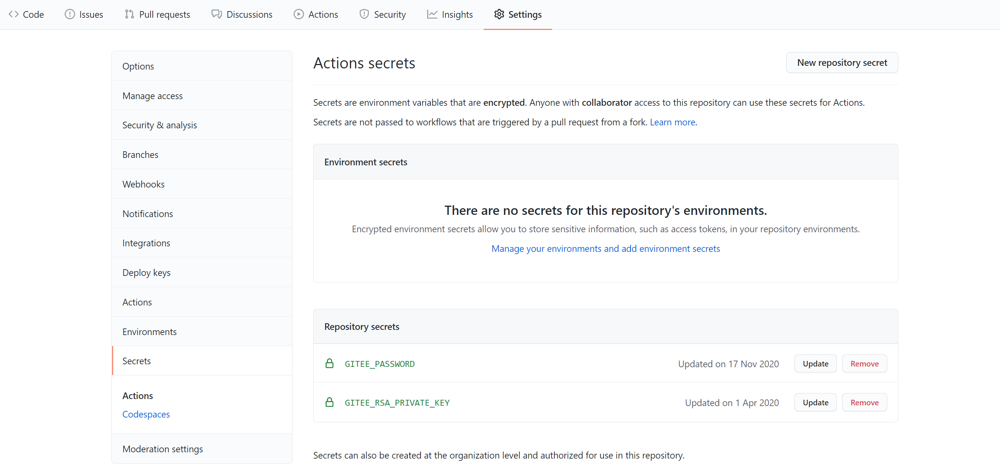

<p align="center">
  <a href="https://github.com/yanglbme/gitee-pages-action">
    
  </a>
</p>

<div align="center">

[](https://github.com/yanglbme/gitee-pages-action/actions) [](https://github.com/yanglbme/gitee-pages-action/actions) [](https://github.com/yanglbme/gitee-pages-action) [](https://gitee.com/yanglbme/gitee-pages-action) [](#谁在使用) [](../../pulls)<br>[](../../releases) [](./LICENSE) [](https://github.com/yanglbme/gitee-pages-action/wiki/FAQ)

</div>

<h1 align="center">Gitee Pages Action</h1>

由于 Gitee Pages 的访问速度很快，很多朋友会选择 Gitee Pages 部署项目（如：个人博客、开源项目国内镜像站点）。但是它不像 GitHub Pages 那样，一提交代码就能自动更新 Pages，因为 Gitee 的自动部署属于 Gitee Pages Pro 的服务。

为了实现 Gitee Pages 的自动部署，我开发了 [Gitee Pages Action](https://github.com/marketplace/actions/gitee-pages-action) ，只需要在 GitHub 项目的 Settings 页面下配置 keys，然后在 `.github/workflows/` 下创建一个工作流，引入一些配置参数即可。欢迎体验，若有使用上的问题，也欢迎随时在 [Issues](https://github.com/yanglbme/gitee-pages-action/issues) 反馈。

注：首次需要手动登录 Gitee ，点击“启动”进行 Gitee Pages 服务的部署。

## 入参

| 参数             | 描述                         | 是否必传 | 默认值   | 示例                            |
| ---------------- | ---------------------------- | -------- | -------- | ------------------------------- |
| `gitee-username` | Gitee 用户名                 | 是       | -        | `yanglbme`                      |
| `gitee-password` | Gitee 密码                   | 是       | -        | `${{ secrets.GITEE_PASSWORD }}` |
| `gitee-repo`     | Gitee 仓库（严格区分大小写） | 是       | -        | `doocs/advanced-java`           |
| `branch`         | 要部署的分支（分支必须存在） | 否       | `master` | `gh-pages`                      |
| `directory`      | 要部署的分支上的目录         | 否       |          | `src`                           |
| `https`          | 是否强制使用 HTTPS           | 否       | `true`   | `false`                         |

## 示例

以下是一个完整示例。

在你的 GitHub 仓库 `.github/workflows/` 文件夹下创建一个 .yml 文件，如 `sync.yml`，内容如下：

```yml
name: Sync

on: page_build

jobs:
  build:
    runs-on: ubuntu-latest
    steps:
      - name: Sync to Gitee
        uses: wearerequired/git-mirror-action@master
        env:
          # 注意在 Settings->Secrets 配置 GITEE_RSA_PRIVATE_KEY
          SSH_PRIVATE_KEY: ${{ secrets.GITEE_RSA_PRIVATE_KEY }}
        with:
          # 注意替换为你的 GitHub 源仓库地址
          source-repo: git@github.com:doocs/advanced-java.git
          # 注意替换为你的 Gitee 目标仓库地址
          destination-repo: git@gitee.com:Doocs/advanced-java.git

      - name: Build Gitee Pages
        uses: yanglbme/gitee-pages-action@master
        with:
          # 注意替换为你的 Gitee 用户名
          gitee-username: yanglbme
          # 注意在 Settings->Secrets 配置 GITEE_PASSWORD
          gitee-password: ${{ secrets.GITEE_PASSWORD }}
          # 注意替换为你的 Gitee 仓库，仓库名严格区分大小写，请准确填写，否则会出错
          gitee-repo: doocs/advanced-java
          # 要部署的分支，默认是 master，若是其他分支，则需要指定（指定的分支必须存在）
          branch: gh-pages
```

先使用 [wearerequired/git-mirror-action](https://github.com/wearerequired/git-mirror-action) 将 GitHub 仓库同步到 Gitee 仓库，再使用 [yanglbme/gitee-pages-action](https://github.com/yanglbme/gitee-pages-action) 实现 Gitee Pages 的自动部署。

请确保在 GitHub 项目的 Settings -> Secrets 路径下配置好 `GITEE_RSA_PRIVATE_KEY` 以及 `GITEE_PASSWORD` 两个密钥。其中：

- `GITEE_RSA_PRIVATE_KEY`: 存放你的 `id_rsa` 私钥。
- `GITEE_PASSWORD`: 存放你的 Gitee 帐号的密码。



如果一切配置正常，并成功触发 [Gitee Pages Action](https://github.com/marketplace/actions/gitee-pages-action) ，我们可能会收到一封来自 Gitee 的告警邮件/站内信。放心，这是 GitHub Action 程序帮我们登录到 Gitee 官网，并为我们点击了项目的部署按钮。


注：

1. 如果在使用过程中遇到了 Gitee 短信验证码导致 Gitee Pages Action 无法自动登录部署 Pages，参考 [#6](https://github.com/yanglbme/gitee-pages-action/issues/6) 。
1. Gitee 仓库名严格区分大小写，若 Action 报 `deploy error occurred` 错误，请检查 `gitee-repo` 参数是否正确配置，参考 [#10](https://github.com/yanglbme/gitee-pages-action/issues/10) 。
1. 若执行 Sync 过程中 Action 提示 `Your push would publish a private email address`，参考 [#18](https://github.com/yanglbme/gitee-pages-action/issues/18) 。

## 谁在使用

<table>
  <tr>
    <td align="center" style="width: 80px;">
      <a href="https://github.com/antvis">
        <br>
        <sub>蚂蚁金服 - 数据可视化</sub>
      </a>
    </td>
    <td align="center" style="width: 80px;">
      <a href="https://github.com/doocs">
        <br>
        <sub>Doocs技术社区</sub>
      </a>
    </td>
    <td align="center" style="width: 80px;">
      <a href="https://github.com/youzan">
        <br>
        <sub>有赞</sub>
      </a>
    </td>
  </tr>
  <tr>
    <td align="left" style="width: 80px;">
      <ul>
        <li><a href="https://github.com/antvis/g">antvis/g</a></li>
        <li><a href="https://github.com/antvis/F2">antvis/F2</a></li>
        <li><a href="https://github.com/antvis/G6">antvis/G6</a></li>
        <li><a href="https://github.com/antvis/L7">antvis/L7</a></li>
        <li><a href="https://github.com/antvis/Graphin">antvis/Graphin</a></li>
        <li><a href="https://github.com/antvis/G2Plot">antvis/G2Plot</a></li>
        <li><a href="https://github.com/antvis/antvis.github.io">antvis/antvis.github.io</a></li>
      </ul>
    </td>
    <td align="left" style="width: 80px;">
      <ul>
        <li><a href="https://github.com/doocs/jvm">doocs/jvm</a></li>
        <li><a href="https://github.com/doocs/leetcode">doocs/leetcode</a></li>
        <li><a href="https://github.com/doocs/advanced-java">doocs/advanced-java</a></li>
        <li><a href="https://github.com/doocs/doocs.github.io">doocs/doocs.github.io</a></li>
        <li><a href="https://github.com/doocs/source-code-hunter">doocs/source-code-hunter</a></li>
      </ul>
    </td>
    <td align="left" style="width: 80px;">
      <ul>
        <li><a href="https://github.com/youzan/vant-weapp">youzan/vant-weapp</a></li>
        <li><a href="https://github.com/youzan/vant">youzan/vant</a></li>
      </ul>
    </td>
  </tr>
</table>

## FAQ

请查看[这里](./FAQ.md) 。

## 许可证

[MIT](LICENSE)
